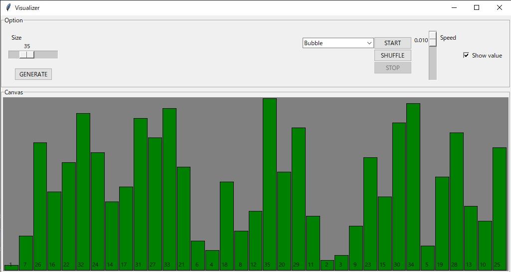
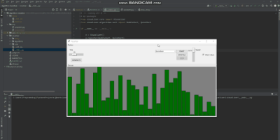
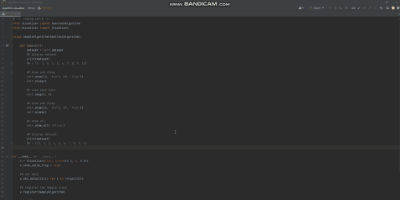

# Algorithm Visualizer






## How to use
### Install a below package
```bash
pip install git+https://github.com/BlackHatD/algorithm-visualizer.git
```
<br>

### Quick start
```bash
python -m visualizer
```

<br>

### Using the package
```python
from visualizer import Visualizer
from visualizer.algorithms.sort import BubbleSort, QuickSort

## create an instance
v = Visualizer()

## register sort algorithms
v.register(BubbleSort, QuickSort)

## initialize the instance
v.init()

## execute mainloop
v.mainloop()
```
<br>

## Create a customized algorithm
- Samples
  - [buble_sort.py](./visualizer/algorithms/sort/buble_sort.py)
    - [sample_buble_sort.py](./visualizer/algorithms/sort/_samples/sample_buble_sort.py)
  - [quick_sort.py](./visualizer/algorithms/sort/quick_sort.py)
    - [sample_quick_sort.py](./visualizer/algorithms/sort/_samples/sample_quick_sort.py)
### Import below modules
```python
from visualizer import AbstractAlgorithm
```
### Inherit it and override the `run` method
```python
class SampleAlgorithm(AbstractAlgorithm):
    def run(self):
        """do something"""
        ## user defined data list is stored self.dataset
        dataset = self.dataset
```
**Note**:   
　In the `AbstractAlgorithm`,   
　a customized data object, which is [`DataObj`](./visualizer/core/data/data_obj.py), is used.  
　So if you want to get a value, use `.value`
```python
# -*- coding:utf-8 -*-
from visualizer import AbstractAlgorithm

class SampleAlgorithm(AbstractAlgorithm):
    def run(self):
        dataset = self.dataset
        print(dataset)
        ## >> [1, 2, 3, 4, 5, 6, 7, 8, 9, 10]

        ## displayed '1', but
        ## real value is the instance address!!
        print(dataset[0])
        ## >> 1
        
        value = dataset[0].value
        print(value)
        ## >> 1
        
        print(dataset[0].get_obj_details())
        ## >> {}
        
        ## if this instance is used in a visualizer
        ## display things like that
        ## >> {'Sample': {'OBJ': None, 'COLOR': None, 'OFFSET': (0, 0), 'POS': ((0, 0), (0, 0)), 'SIZE': (0, 0)}}
        
        print(dataset)
        self.swap(0, 9)
        print(dataset)
        ## >> [1, 2, 3, 4, 5, 6, 7, 8, 9, 10]
        ## >> [+] swap(0, 9)
        ## >>    index_1: 0
        ## >>    index_2: 9
        ## >>             |  0 |  1 |  2 |  3 |  4 |  5 |  6 |  7 |  8 |  9 |
        ## >>    Before ->|  1 |  2 |  3 |  4 |  5 |  6 |  7 |  8 |  9 | 10 |
        ## >>    After  ->| 10 |  2 |  3 |  4 |  5 |  6 |  7 |  8 |  9 |  1 |
        ## >>
        ## >> [10, 2, 3, 4, 5, 6, 7, 8, 9, 1]
        
        
if __name__ == '__main__':
  sample = SampleAlgorithm()
  sample.set_data([(i+1) for i in range(10)])
  sample.run()
```
  

- Useful methods in the `AbstractAlgorithm` class
  - for drawing and erasing things in a canvas widget
    - `draw`
    - `draw_all`
    - `reset_colors`
    - `reset_color_all`
    - `erase`
    - `erase_all`
  - for sleeping (the method isn't make sense if not using in a visualizer)
    - `sleep`
  - for swapping each data
    - `swap`

**NOTE**  
These useful methods are overridden when used it in the `Visualizer`.

<br>

### Sample code


```python
# -*- coding:utf-8 -*-
from visualizer import (
  AbstractAlgorithm
  , Visualizer
)

class SampleAlgorithm(AbstractAlgorithm):

    def run(self):
        dataset = self.dataset
        
        ## display dataset
        print(dataset)
        ## > [1, 2, 3, 4, 5, 6, 7, 8, 9, 10]

        ## draw and sleep
        self.draw((0, 'Red'), (9, 'Pink'))
        self.sleep()

        ## swap each data
        self.swap(0, 9)

        ## draw and sleep
        self.draw((0, 'Red'), (9, 'Pink'))
        self.sleep()

        ## draw all
        self.draw_all('Yellow')

        ## display dataset
        print(dataset)
        ## > [10, 2, 3, 4, 5, 6, 7, 8, 9, 1]
        
        #print(dataset[0])
        #print(dataset[0].get_obj_details())


if __name__ == '__main__':
    v = Visualizer(limit_speed=(0.5, 1, 0.5))
    v.show_value_flag = True

    ## set data
    v.set_data([(i+1) for i in range(10)])

    ## register the Sample class
    v.register(SampleAlgorithm)

    v.init()
    v.mainloop()
```
<br>


## TODOs
- write more details
- add other sort algorithms
- add search algorithms

<br>